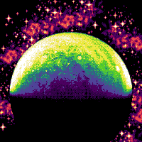

# Terraformers [](https://github.com/DeltaZen/terraformers/actions/workflows/ci.yml) [](https://github.com/prettier/prettier)



## Story

2133 AD: Artificial Intelligence finally took your job,
worried about not being able to pay rent for your sleep capsule,
you decided to get your hands dirty as a cleaner in a terraforming company,
clearing planets from hostile live forms for a low wage.

### How to play

-   Attacking is automatic
-   WASD/arrows/touch & drag to move
-   Click/touch/space to use menus & select items
-   The game also supports controllers

## Contributing

### Installing Dependencies

After cloning this repo, install dependencies:

```
pnpm i
```

### Checking code format

```
pnpm check
```

### Testing the app in the browser

To test your work in your browser (with hot reloading!) while developing:

```
pnpm start
```

### Building

To package the WebXDC file:

```
pnpm build
```

To package the WebXDC with developer tools inside to debug in Delta Chat, set the `NODE_ENV`
environment variable to "debug":

```
NODE_ENV=debug pnpm build
```

The resulting optimized `.xdc` file is saved in `dist-xdc/` folder.

### Releasing

To automatically build and create a new GitHub release with the `.xdc` file:

```
git tag -a v1.0.1
git push origin v1.0.1
```

## Credits

-   This is a fork of [Xiicur Survivors](https://github.com/rottencandy/js13k2024) by [saud](https://github.com/rottencandy)
-   [Zzfxm](https://github.com/keithclark/ZzFXM) for music

### Art Assets

-   hero1 sprite is a modification of: https://trevor-pupkin.itch.io/outer-buddies
-   inspiration: https://opengameart.org/content/frogatto-friends-npc-pack
-   inspiration: https://opengameart.org/content/super-dead-gunner-reaperbot-enemy
-   app icon and title screen background by Emcee Flesher (CC-BY 4.0): https://opengameart.org/content/super-dead-space-gunner-merc-redux-space-junkyard-environment
-   mob3 was created by Emcee Flesher (CC-BY 4.0): https://opengameart.org/content/super-dead-gunner-batch-3
-   some public domain mobs taken from: https://opengameart.org/content/16x16-fantasy-rpg-trash-mobs-animated
